# Trackwise

**Job tracking, without chaos.**

Trackwise is a productivity-focused job application tracking SaaS built for serious job seekers who want clarity, structure, and follow-through — not spreadsheets, sticky notes, or half-baked trackers.

It models **real hiring workflows**, not just CRUD screens.

---

## 📸 Preview

### 1️⃣ Landing Page

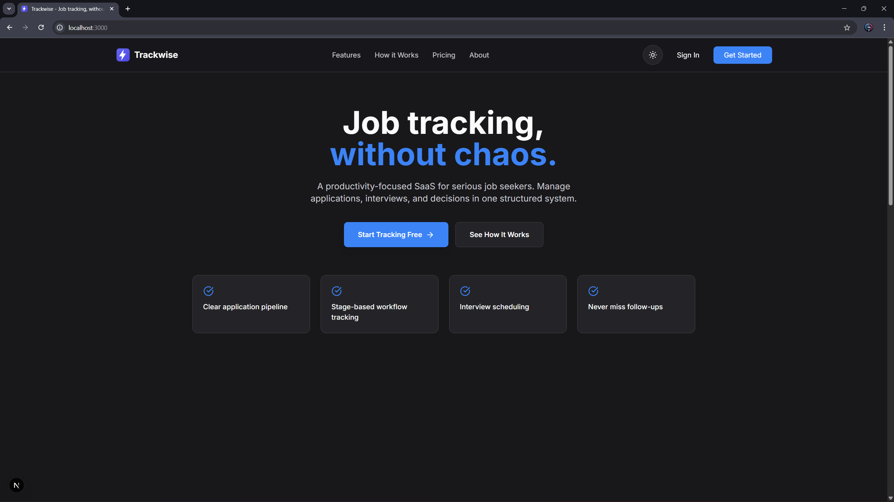

---

### 2️⃣ Authentication

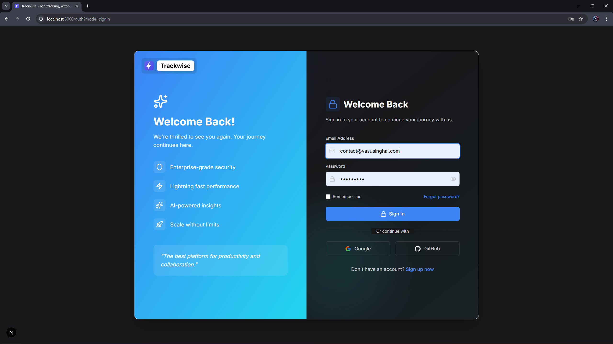
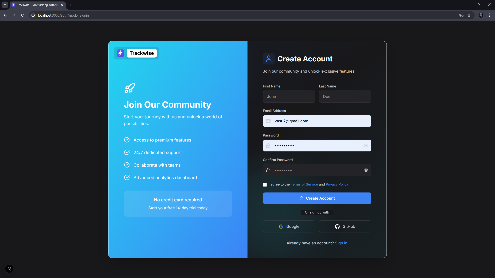

---

### 3️⃣ Onboarding

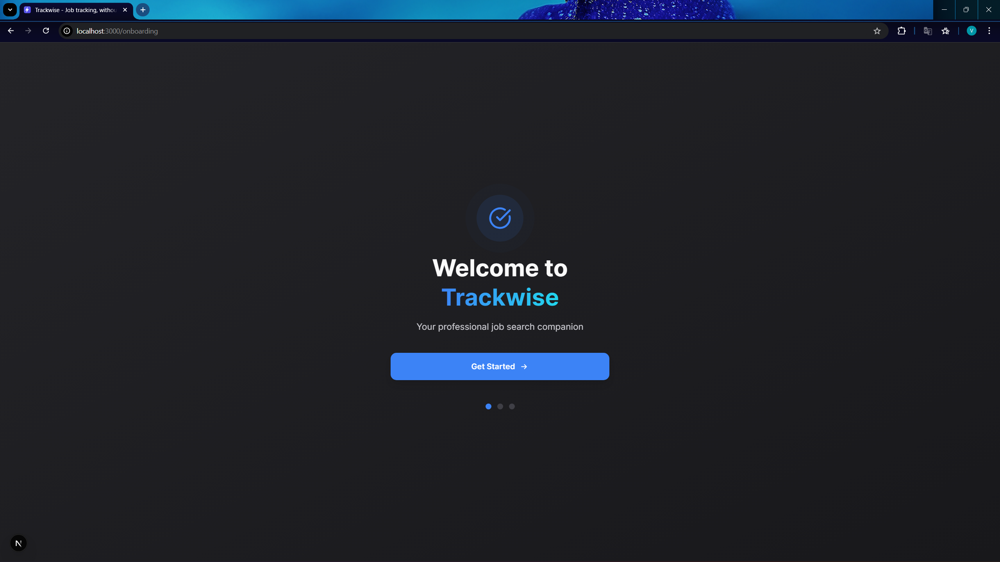
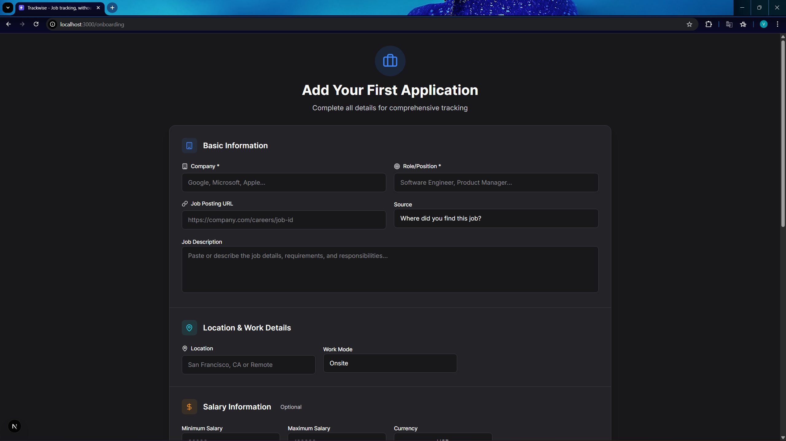

---

### 4️⃣ Dashboard

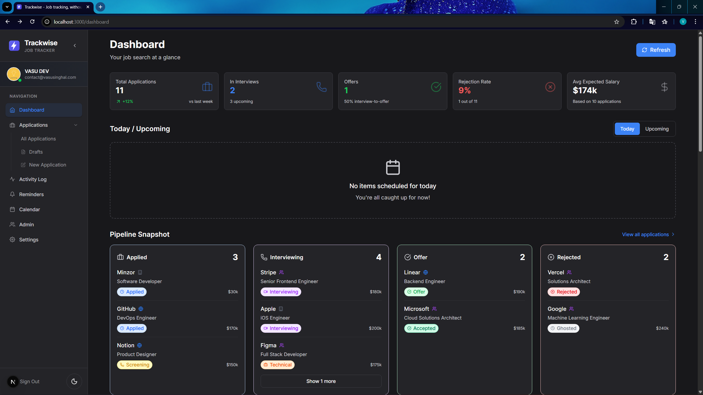

---

### 5️⃣ Applications

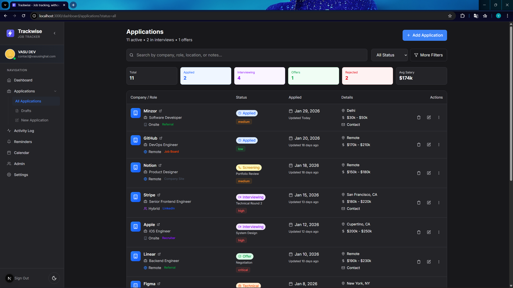
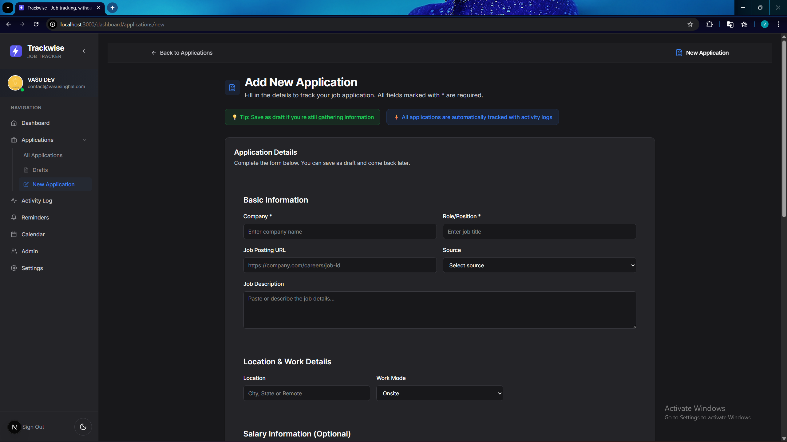
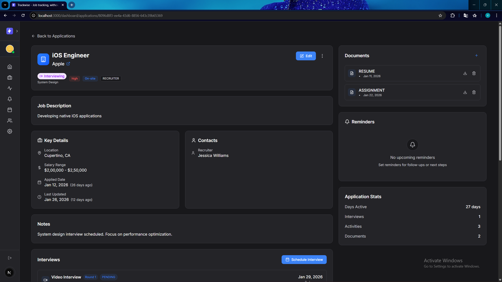

---

### 6️⃣ Activity Timeline

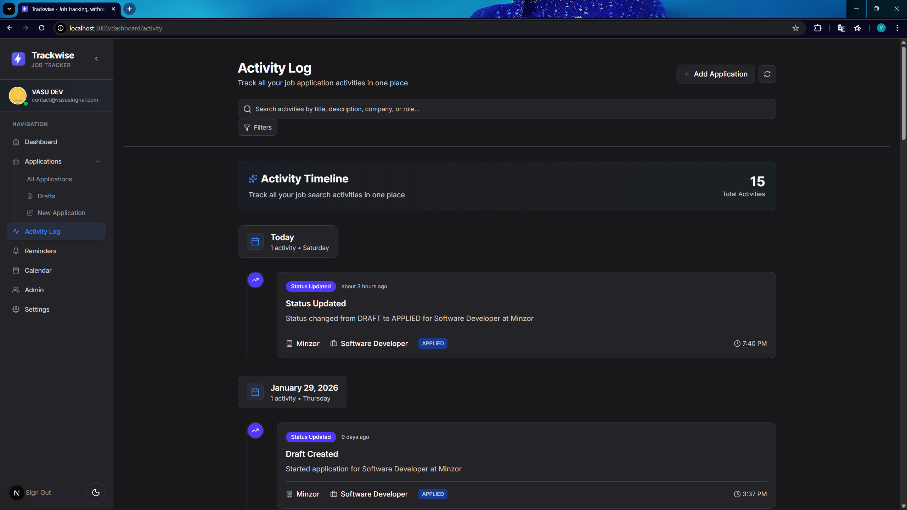

---

### 7️⃣ Settings

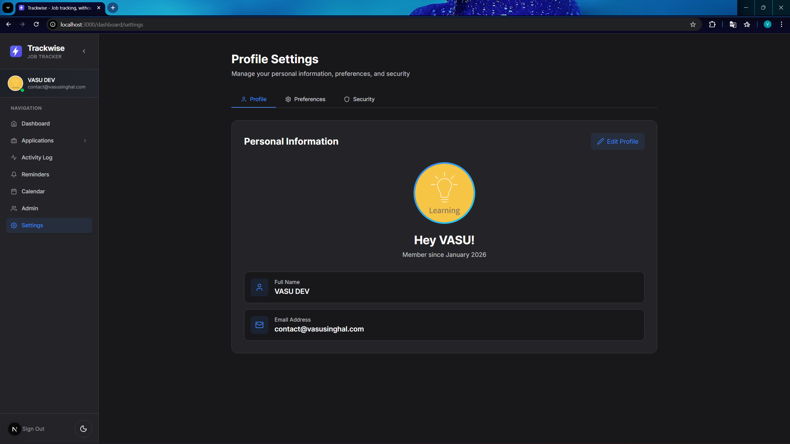
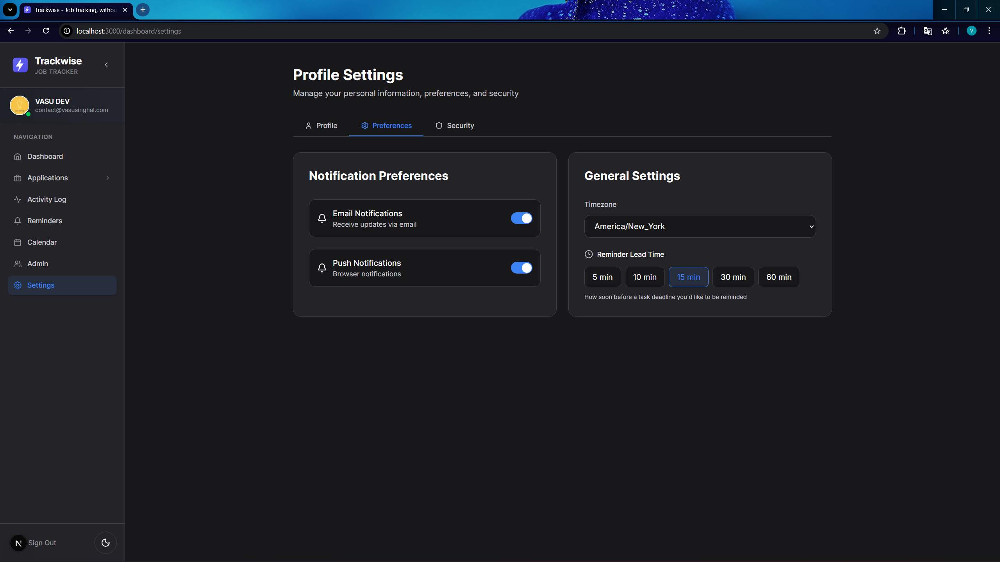
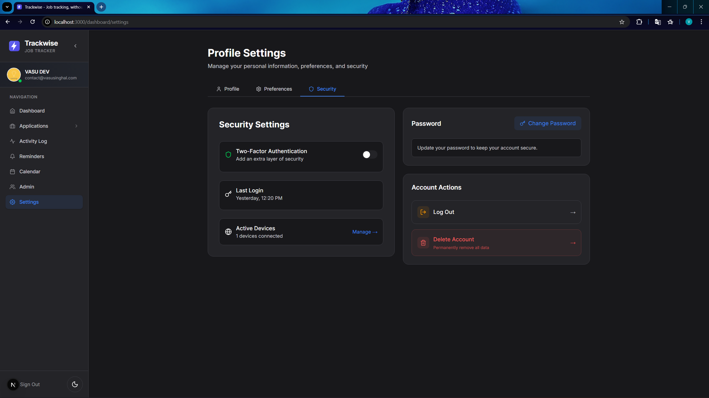

---

## 🎯 What Trackwise Solves

Most job trackers fail because they treat applications as static rows.

In reality, a job search is:

- **Multi-stage** — screening, interviews, technical rounds, offers
- **Time-sensitive** — interviews, deadlines, and follow-ups matter
- **Action-driven** — every application has a next step

Trackwise is designed to answer one question:

> **“What should I do next?”**

Everything else is secondary.

---

## 🧠 Dashboard Philosophy

The dashboard has **one job**:
**show what needs attention right now**.

No charts.
No trends.
No vanity metrics.

### What the Dashboard Shows

#### 1️⃣ Today / Upcoming

- Interviews scheduled
- Deadlines approaching
- Time-sensitive application actions

Displayed with minimal context:

- Company
- Role
- Action
- Time (Today / Tomorrow / Date)

If the user knows their next move, the dashboard succeeds.

#### 2️⃣ Pipeline Snapshot

A lightweight overview of the current pipeline:

- Active applications
- Applications in interviews
- Offers received

This is a **summary**, not analytics.

---

## ✨ Core Features (Live)

### 🔐 Authentication & Security

- Email & password authentication
- Google & GitHub OAuth
- Email verification
- Session-based auth with Better Auth
- Protected routes enforced server-side
- Rate limiting & bot protection via Arcjet

---

### 📋 Application Management

Full CRUD workflow:

- Add new applications
- View applications list
- Search & filter
- Edit applications
- View detailed application pages
- Delete or archive applications

Tracked data includes:

- Company & role
- Application status & stage
- Priority
- Work mode (ONSITE / HYBRID / REMOTE)
- Salary range
- Source (LinkedIn, referral, recruiter, etc.)
- Recruiter & contact details
- Notes and deadlines

---

### 🧠 Application Workspace

Each application has a dedicated workspace:

- Status, stage, priority badges
- Job description
- Contacts
- Notes
- Interview list
- Documents list
- Activity timeline
- Quick stats (days active, interviews, activities, documents)

This is where the job search actually happens.

---

### 🕒 Activity Timeline (Source of Truth)

- Global activity log
- Per-application timelines
- Chronological, immutable events
- Real timestamps (`occurredAt`)
- Grouped by date
- Filtering & search
- Pagination (load more)
- Visual emphasis on key events (interviews, offers)

The UI is driven by events — not derived guesses.

---

### 📅 Interviews

- Multiple interview rounds per application
- Interview types: phone, video, onsite, assessment, panel
- Scheduling with timezone support
- Interviewer details
- Notes, feedback, and self-rating
- Outcome tracking (pending, passed, failed, cancelled, rescheduled)

---

### 📄 Document Management

- Attach resumes, cover letters, portfolios, assignments
- Versioned per application
- Metadata stored (file size, type, upload time)
- Cloud storage via Cloudinary

---

## ⏳ Coming Soon (Defined, Not Live Yet)

These exist at the schema/UI level but are **not yet fully implemented**:

- Reminders & follow-ups
- Calendar view
- Advanced analytics
- Bulk operations

Features are added intentionally — not dumped.

---

## 🧪 Data Integrity

- PostgreSQL + Prisma
- Normalized relational schema
- Indexed for dashboard and timeline queries
- Explicit timestamps (`occurredAt` vs `createdAt`)
- No silent writes

---

## ⚙️ Architecture

- Server-first design
- All mutations via Next.js Server Actions
- Validation and auth enforced on the server
- Predictable data flow, minimal API surface

---

## 🛠 Tech Stack

**Frontend**

- Next.js 16 (App Router)
- React 19
- TypeScript
- Tailwind CSS
- GSAP

**Backend & Data**

- PostgreSQL
- Prisma
- Server Actions

**Infra & Services**

- Better Auth
- Postmark
- Cloudinary
- Arcjet
- Zod

---

## 🚀 Local Development

```bash
npm install
npx prisma migrate dev
npm run dev
```

App runs at `http://localhost:3000`.

---

## 📌 Project Status

**Active development — v0.1.0**

Focused on correctness, UX, and real job-search workflows.

---

## 🎯 Why Trackwise Exists

Job applications aren’t a list.
They’re a process.

Trackwise exists to:

- Preserve context
- Surface the next action
- Prevent missed interviews and deadlines
- Act as a single source of truth during a job search

Built for people who actually want results.

---

## 📝 License

Private project. All rights reserved.
